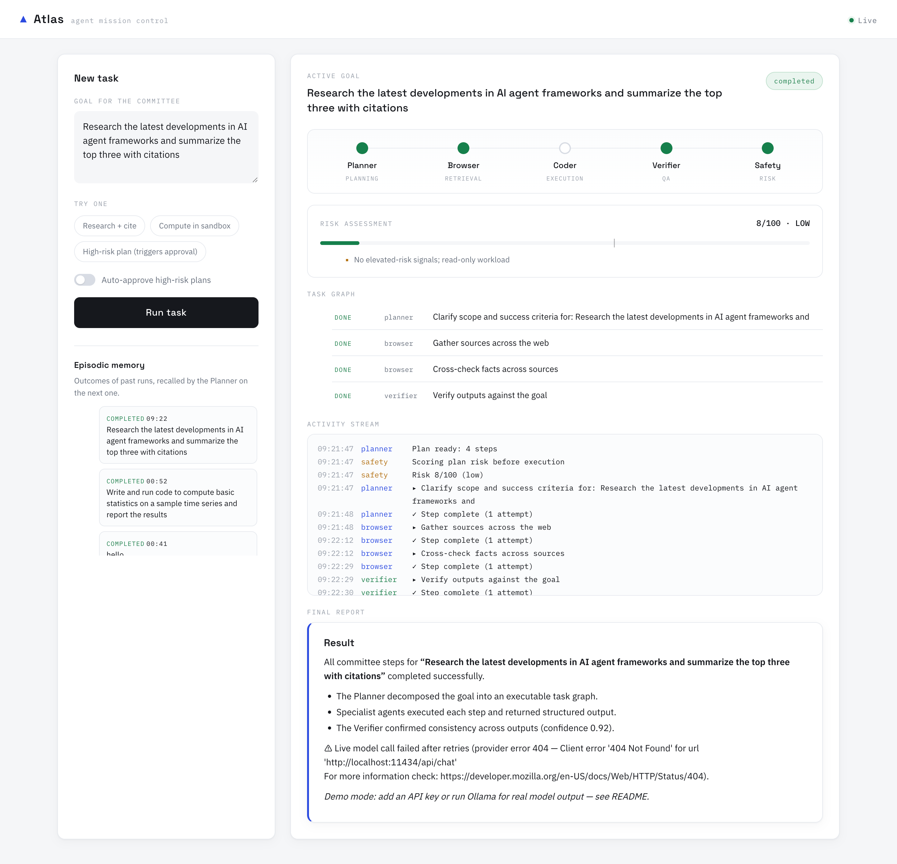

# Atlas

A committee of five agents (Planner, Safety, Coder, Browser, Verifier) run by one orchestrator. The orchestrator decides what happens next; the agents only think. Every state change is written to the database before anyone hears about it, so a task can be audited, replayed, or picked back up after a restart.



## What it does

You give Atlas a goal. The Planner turns it into steps. The Safety agent scores the plan, and a fixed set of keyword rules scores it too — the higher of the two wins, so a persuasive model can't talk its way past the gate. Anything over the threshold stops and waits for a person. Steps then run one by one: the Browser searches and reads pages, the Coder writes Python and runs it in a sandbox, the Verifier checks the result against the goal and can send everything back for one more pass. The Planner writes the final report.

While that happens, the UI shows the live event stream over SSE, the risk score, the task graph, and the approval buttons when they're needed.

Everything runs in demo mode with no API keys and no network. Add a key or point it at Ollama and the same code talks to a real model.

## Running it

```bash
python3 -m venv .venv && . .venv/bin/activate
pip install -r requirements-dev.txt
cp .env.example .env
./run.sh
```

Open <http://127.0.0.1:8000>. This uses SQLite, runs tasks inside the API process, and executes code in a local subprocess sandbox.

```bash
make test   # 38 tests: lifecycle, HTTP, security
make lint
```

## Running it for real

`docker compose up --build` starts PostgreSQL, Redis, a migration job, the API, and a Celery worker. Put these in a `.env` first:

```dotenv
POSTGRES_PASSWORD=...
REDIS_PASSWORD=...
SESSION_SECRET=...          # 32+ characters
ATLAS_API_KEYS=team-a:...   # tenant:key, comma-separated
FORCE_DEMO=1                # or 0 plus a provider key below
```

In this mode:

- Tasks are queued to workers. A high-risk task pauses in the database and frees its worker; approving it puts it back on the queue.
- Each API key maps to a tenant. Tasks, events, and memory are scoped to that tenant at every endpoint.
- The browser UI trades the key for a signed, HttpOnly session cookie, so the key never sits in the page.
- Code runs in a throwaway Docker container: no network, read-only filesystem, dropped capabilities, CPU/memory/PID limits.
- Web fetches are checked for private IPs, redirects into private ranges, odd ports, binary content, and size.
- Rate limits and SSE fan-out go through Redis so several API replicas behave as one.
- Logs are JSON, every response carries a request ID, and `/metrics` speaks Prometheus.

## API

| Method | Path | |
|---|---|---|
| `GET` | `/api/health` | dependency checks |
| `POST` | `/api/session` | exchange an API key for a browser session |
| `POST` | `/api/tasks` | create a task |
| `GET` | `/api/tasks` | recent tasks for this tenant |
| `GET` | `/api/tasks/{id}` | task detail |
| `POST` | `/api/tasks/{id}/approval` | `{"approved": true\|false}` |
| `GET` | `/api/tasks/{id}/events` | SSE stream, replays from the database after a reconnect |
| `GET` | `/api/audit` | event log |
| `GET` | `/api/memory` | episodic memory |
| `GET` | `/metrics` | Prometheus |

## Layout

```
app/
  orchestrator.py   lifecycle, approval gate, retries, rework, recovery
  agents/           planner, safety, coder, browser, verifier
  tools/            code_exec (sandbox), web (search + fetch)
  storage.py        SQLAlchemy models and queries
  task_queue.py     Celery tasks and beat schedule
  event_bus.py      local + Redis pub/sub fan-out
  auth.py           API keys, signed sessions, tenant context
  rate_limit.py     fixed-window limiter
  observability.py  JSON logs, metrics, security headers
  risk.py           keyword rules merged with the Safety agent's score
  memory.py         working memory + episodic memory
static/             the UI, plain HTML/JS/CSS
migrations/         Alembic
tests/              pytest
```

More in [docs/architecture.md](docs/architecture.md), [docs/runbook.md](docs/runbook.md), and [SECURITY.md](SECURITY.md).

## Models

Set `FORCE_DEMO=0` and one of `ANTHROPIC_API_KEY`, `CEREBRAS_API_KEY`, `GEMINI_API_KEY`, `GROQ_API_KEY`, or `OLLAMA_BASE_URL` in `.env`. The server checks the provider at startup and in `/api/health`; if Ollama isn't running or the model isn't pulled, the UI shows a banner saying exactly what to run. A model call that fails mid-task fails the task with the same message rather than finishing with placeholder output.
