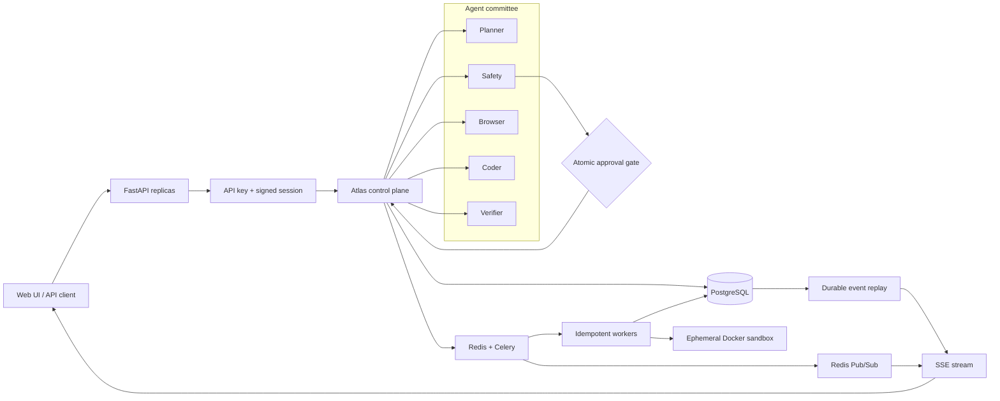

<div align="center">

# Atlas

### Production-grade, human-gated multi-agent execution platform

Five specialist agents coordinated by a durable control plane with deterministic
risk policy, atomic approvals, isolated code execution, bounded verification,
multi-tenant persistence, and real-time operational visibility.

[](https://github.com/xiyiji/atlas-llm-execution-agent/actions/workflows/ci.yml)


`agent orchestration` · `human-in-the-loop safety` · `durable execution` ·
`distributed workers` · `transactional audit trail` · `sandboxed tools`

[Interactive mission control](https://xiyiji.github.io/projects/atlas-demo.html)

</div>


Atlas is an end-to-end LLM execution system built around a simple operational
principle: model reasoning proposes work; the control plane owns execution.
Planner, Safety, Browser, Coder, and Verifier agents contribute specialist
decisions while the orchestrator enforces state transitions, authorization,
retries, recovery, and auditability outside the model.

## Why this system is different

- **Deterministic safety above probabilistic reasoning.** Model risk scores are
  merged with a rule-based floor, so an LLM cannot downgrade a consequential
  action below the human-approval threshold.
- **Durable execution across process failures.** Task graphs, attempt counters,
  decisions, outputs, and events are persisted after every transition; workers
  resume from the last completed step instead of restarting the workflow.
- **Atomic human approval.** Approval and timeout paths use single-writer database
  transitions, preventing competing API replicas or schedulers from reversing a
  decision.
- **Transactional observability.** State changes and their audit events commit in
  the same SQL transaction before Redis fan-out, keeping recovery and replay
  aligned with the source of truth.
- **Defense-in-depth tool execution.** Generated Python runs in an ephemeral,
  network-disabled, read-only Docker container with dropped capabilities and
  CPU, memory, process, time, and output limits.
- **Provider-neutral model layer.** The same structured-output contract supports
  Anthropic, Cerebras, Gemini, Groq, and Ollama with credential/readiness probes,
  retryable schema enforcement, and explicit provider failures.

## Architecture



PostgreSQL is the durable source of truth. Redis accelerates queueing, execution
locks, distributed rate limiting, and cross-replica event fan-out. SSE consumers
receive a snapshot followed by live events and database-backed replay, so a
transient connection loss does not discard task history.

## End-to-end execution lifecycle

1. The authenticated API validates and persists a tenant-scoped task.
2. Planner builds a typed task graph; Safety merges model assessment with a
   deterministic risk floor.
3. Consequential work pauses without holding a worker until an authorized human
   approves or denies it.
4. Celery dispatches the task under a per-task Redis lock, providing idempotent
   handling of broker redelivery.
5. Browser and Coder execute guarded tools; attempt state is persisted before
   each call so crash recovery preserves the retry budget.
6. Verifier validates a strict Pydantic decision schema and can trigger one
   feedback-aware rework round.
7. Planner synthesizes the result; terminal state, episodic memory, and the full
   audit sequence remain queryable by tenant.

## Technology stack

| System layer | Technologies | Engineering responsibility |
|---|---|---|
| LLM and agents | Anthropic API, Cerebras, Gemini, Groq, Ollama, structured JSON outputs | Multi-provider inference, planning, safety, tool use, verification |
| API and contracts | Python 3.12, FastAPI, Uvicorn, Pydantic v2, asyncio, HTTPX | Async REST API, validation, lifecycle control, provider integration |
| Durable state | PostgreSQL, SQLAlchemy 2, Alembic, SQLite | Task state machine, migrations, audit events, episodic memory |
| Distributed execution | Celery, Redis, Pub/Sub, distributed locks | Worker dispatch, redelivery control, multi-replica event delivery |
| Safety and tenancy | API keys, HMAC-signed sessions, CORS, Trusted Hosts, SSRF controls | Tenant isolation, authorization, request limits, guarded retrieval |
| Tool sandbox | Docker, Linux capabilities, cgroups-style resource limits | Network isolation, read-only runtime, CPU/memory/PID/time limits |
| Real-time UI | Server-Sent Events, HTML, CSS, JavaScript | Snapshot + replay + live stream, approval workflow, mission control |
| Observability | Prometheus, structured JSON logs, request IDs, liveness/readiness probes | Metrics, correlation, dependency health, operational diagnosis |
| Delivery and quality | Docker Compose, GitHub Actions, pytest, Ruff, pip-audit, Alembic | Reproducible deployment, distributed integration tests, supply-chain checks |

## Reliability and security controls

| Failure mode | Atlas mechanism |
|---|---|
| Worker crash or API restart | Durable checkpoints and recovery from the last completed step |
| Broker redelivery | Per-task Redis execution lock and terminal-state idempotency |
| Approval/timeout race | Atomic compare-and-update transition in PostgreSQL |
| Malformed model response | Strict Pydantic contracts plus bounded retries |
| Provider outage or invalid key | Authenticated readiness probe and explicit task failure |
| SSE disconnect | Snapshot, Redis live fan-out, SQL replay, terminal-event normalization |
| Generated-code runaway | Ephemeral container plus forced timeout cleanup |
| Cross-tenant access | Server-derived tenant identity on every task, event, and memory query |
| Prompt injection through tools | Untrusted-content markers, agent guard prompts, SSRF and content controls |

## Run locally

```bash
python3 -m venv .venv
. .venv/bin/activate
pip install -r requirements-dev.txt
cp .env.example .env
./run.sh
```

Open <http://127.0.0.1:8000>. The local profile uses the same orchestrator,
persistence model, approval gate, sandbox policy, UI, and API contracts with a
deterministic provider for credential-free development and regression testing.

## Run the distributed production topology

```bash
export POSTGRES_PASSWORD='replace-with-a-secret'
export REDIS_PASSWORD='replace-with-a-secret'
export ATLAS_API_KEYS='team-a:replace-with-an-api-key'
export SESSION_SECRET='replace-with-at-least-32-random-characters'
docker compose up --build
```

This starts PostgreSQL, Redis, an Alembic migration job, the FastAPI service,
and Celery workers. CI runs an authenticated task through this complete topology,
including Docker-isolated generated-code execution, before a change can pass.

## Connect a model provider

Set `FORCE_DEMO=0` and configure any supported provider:

```dotenv
ANTHROPIC_API_KEY=
CEREBRAS_API_KEY=
GEMINI_API_KEY=
GROQ_API_KEY=
OLLAMA_BASE_URL=http://localhost:11434
OLLAMA_MODEL=llama3.2
```

Atlas checks provider connectivity and credentials through cached readiness
probes. Model output is normalized through `complete` and `complete_json`, with
strict schemas applied at planning, safety, coding, and verification boundaries.

## API surface

| Method | Path | Purpose |
|---|---|---|
| `GET` | `/api/live` | Process liveness |
| `GET` | `/api/ready` | Dependency-aware readiness |
| `GET` | `/api/health` | Detailed operational diagnostics |
| `POST` | `/api/session` | Exchange an API key for a signed browser session |
| `POST` | `/api/tasks` | Create and dispatch a tenant-scoped task |
| `GET` | `/api/tasks` | List recent tenant tasks |
| `GET` | `/api/tasks/{id}` | Read task graph, state, outputs, and verification |
| `POST` | `/api/tasks/{id}/approval` | Resolve a waiting approval gate |
| `GET` | `/api/tasks/{id}/events` | Stream snapshot, replay, and live events over SSE |
| `GET` | `/api/audit` | Read the tenant audit sequence |
| `GET` | `/api/memory` | Read tenant-scoped episodic memory |
| `GET` | `/metrics` | Export Prometheus metrics |

## Verification

```bash
make lint
make test
pip-audit -r requirements.txt
alembic upgrade head
```

The suite currently contains **52 passing tests** across orchestration, retries,
rework, crash recovery, approval concurrency, HTTP/SSE behavior, provider
failures, tenant isolation, sandbox enforcement, SSRF controls, and readiness.
GitHub Actions additionally builds the image and executes an authenticated task
through PostgreSQL, Redis, Celery, FastAPI, Alembic, and the Docker sandbox.

Detailed design and operations material lives in [architecture](docs/architecture.md),
the [operations runbook](docs/runbook.md), and the [security model](SECURITY.md).
