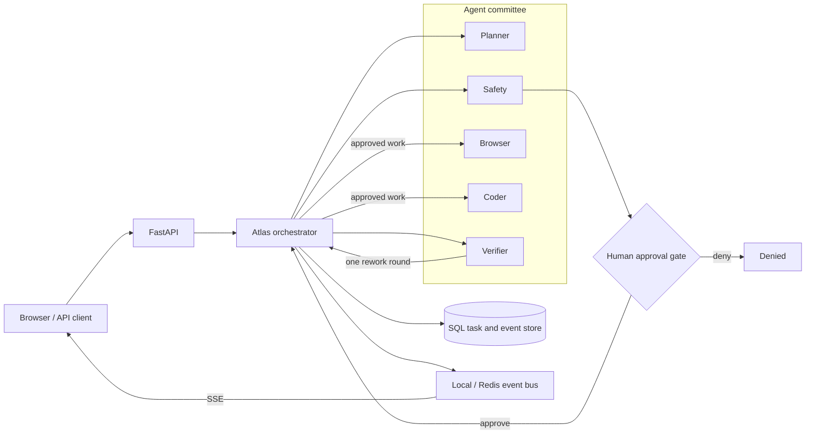

<div align="center">

# Atlas

### A demo-first control plane for human-gated multi-agent execution

Five specialist agents coordinated by one orchestrator, with deterministic risk
scoring, approval gates, bounded verification, durable records, and a live SSE UI.

[](https://github.com/xiyiji/atlas-llm-execution-agent/actions/workflows/ci.yml)


`multi-agent orchestration` · `human approval` · `bounded rework` ·
`durable task state` · `SSE events` · `sandboxed execution`

[Live demo](https://xiyiji.github.io/projects/atlas-demo.html)

</div>


Atlas is a committee-style execution runtime. Planner, Safety, Coder, Browser,
and Verifier agents produce specialist outputs, while a central orchestrator owns
the control flow: planning, risk assessment, approval, retries, verification,
rework, state transitions, and audit events.

The default demo is deterministic. It runs end to end on a laptop without a
model key and without external network access, which makes the full lifecycle
easy to inspect and test.

## Architecture



The agents do not call one another. They return outputs to the orchestrator,
which keeps lifecycle policy separate from model reasoning.

## How a run works

1. **Planner** turns a goal into two to six concrete steps.
2. **Safety** scores the plan, and a deterministic keyword engine supplies a
   risk floor that the model cannot lower.
3. High-risk work pauses at an explicit **human approval gate**.
4. **Browser**, **Coder**, and Planner steps run with bounded retries.
5. **Verifier** checks the result against the goal and may request one rework
   round.
6. Planner synthesizes the final Markdown report while task state and audit
   events remain available through the API and UI.

## Technology stack

| Layer | Technology | Responsibility |
|---|---|---|
| API and UI | FastAPI, Uvicorn, Pydantic v2, HTML/CSS/JavaScript | REST API, SSE stream, mission-control interface |
| Agent layer | Provider-neutral async LLM client | Planner, Safety, Coder, Browser, Verifier |
| Control plane | Python asyncio | Lifecycle, approval, retry, rework, recovery |
| Persistence | SQLAlchemy 2, SQLite, PostgreSQL, Alembic | Tasks, audit events, episodic memory, migrations |
| Background execution | Celery, Redis | Worker dispatch, locks, Pub/Sub fan-out, rate limits |
| Tools | Isolated Python subprocess, optional Docker backend, httpx | Code execution and guarded web retrieval |
| Operations | Prometheus, structured JSON logging, request IDs | Metrics and operational diagnostics |
| Delivery | Dockerfile, Docker Compose, GitHub Actions | Packaging, lint, tests, dependency audit, image build |

## Implemented and verified scope

| Capability | Status | Evidence boundary |
|---|---|---|
| Deterministic no-key demo | Verified | Local API and browser workflow |
| Five-agent committee and central orchestration | Verified | Unit and lifecycle tests |
| Risk floor and human approval | Verified | Low-risk, approval, and denial paths |
| Retry and single rework round | Verified | Deterministic test cases |
| SQLite persistence and restart recovery | Verified | Migration and lifecycle tests |
| Tenant-scoped API keys and signed browser sessions | Verified | HTTP isolation tests |
| SSE snapshot, live events, and database polling | Implemented | Local and HTTP tests; reconnect hardening remains |
| SSRF-oriented URL checks and local sandbox policy | Verified in application tests | Not a high-assurance security boundary |
| PostgreSQL, Redis, Celery, and Docker Compose | Production-oriented foundation | Full distributed stack is not yet integration-validated |

## Run the validated demo

```bash
python3 -m venv .venv
. .venv/bin/activate
pip install -r requirements-dev.txt
cp .env.example .env
./run.sh
```

Open <http://127.0.0.1:8000>. The default configuration uses SQLite,
in-process task execution, and the local isolated Python runner.

Try these goals:

```text
Research current AI agent frameworks and summarize three with citations
Write and run Python to compute statistics for a sample time series
Plan how to delete stale records from a production database
```

The last goal should pause for human approval before any step executes.

## Use a live model

Set `FORCE_DEMO=0` and configure one provider in `.env`:

```dotenv
ANTHROPIC_API_KEY=
CEREBRAS_API_KEY=
GEMINI_API_KEY=
GROQ_API_KEY=
OLLAMA_BASE_URL=http://localhost:11434
OLLAMA_MODEL=llama3.2
```

Atlas normalizes calls through one `complete` / `complete_json` layer. A failed
provider call fails the task visibly with an operator-facing hint instead of
quietly substituting demo output. Hosted-provider credentials are fully
validated only when the first model request is made.

## API surface

| Method | Path | Purpose |
|---|---|---|
| `GET` | `/api/health` | Dependency status payload |
| `POST` | `/api/session` | Exchange an API key for a signed browser session |
| `POST` | `/api/tasks` | Create a task |
| `GET` | `/api/tasks` | List recent tenant tasks |
| `GET` | `/api/tasks/{id}` | Read task state and outputs |
| `POST` | `/api/tasks/{id}/approval` | Approve or deny a waiting task |
| `GET` | `/api/tasks/{id}/events` | Stream task events over SSE |
| `GET` | `/api/audit` | Read tenant-scoped audit events |
| `GET` | `/api/memory` | Read episodic memory |
| `GET` | `/metrics` | Prometheus metrics |

## Verification

```bash
make lint
make test
pip-audit -r requirements.txt
alembic upgrade head
```

Current `main` has **46 passing tests** covering core behavior, lifecycle
recovery, HTTP and SSE paths, provider failures, tenant isolation, sandbox
policy, and guarded retrieval. CI also builds the application image.

## Current engineering boundary

Atlas is a validated portfolio MVP with production-oriented infrastructure,
not a production-ready autonomous execution service. Before a multi-replica
deployment, the next engineering pass should complete:

- atomic approval and timeout state transitions;
- Docker sandbox file transfer, timeout cleanup, and orphan recovery;
- strict schemas for verifier output;
- terminal-event and reconnect handling in the SSE client;
- PostgreSQL + Redis + Celery + Docker Compose integration tests;
- transactionally coupled task-state and audit-event writes.

See [architecture](docs/architecture.md), [operations runbook](docs/runbook.md),
and [security model](SECURITY.md) for the current design.
