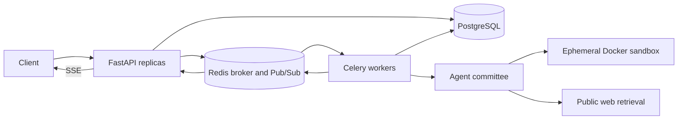

# Architecture

The orchestrator is a control plane. It owns state transitions, approval, retry, event emission, and bounded rework; agents only produce specialist outputs. Every emitted event is persisted before it is broadcast.

Development mode executes tasks in the API process. Production mode persists a queued task, dispatches its ID through Celery, and reloads it inside a worker. High-risk tasks stop in `awaiting_approval` without occupying a worker; approval persists a decision and re-enqueues the task. Redis locks make worker execution idempotent under redelivery.

Because state is written after every event, an API restart in development mode picks unfinished tasks back up (`task.recovered`) and continues from the last completed step. Tasks left waiting for approval longer than `APPROVAL_TIMEOUT_SECONDS` are closed by a Celery beat job in production and by a background janitor in development.

Text that comes back from the web or from tools is wrapped in explicit markers, and every agent's system prompt says to treat it as data rather than instructions.

PostgreSQL is the source of truth. Redis improves dispatch and event latency, while SSE periodically replays missed events from the database. API keys map to tenant IDs, and every task, event, and memory query includes that tenant boundary.
